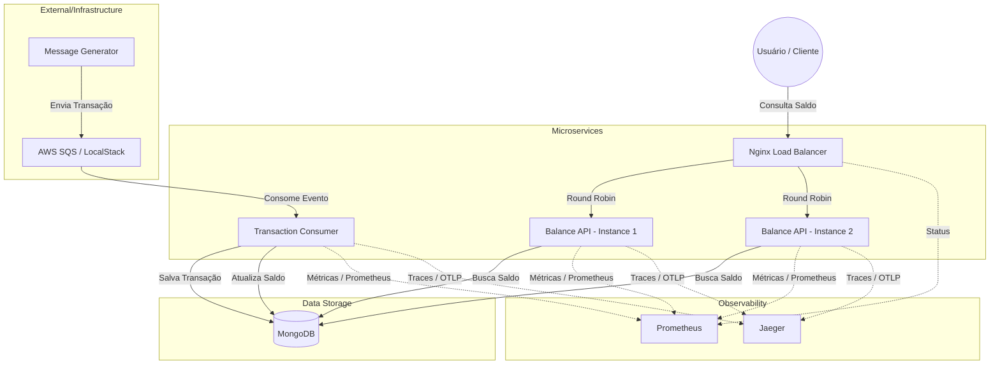

### Arquitetura do Sistema

Este diagrama representa o fluxo de dados e a integração entre os componentes do sistema. Você pode copiar o código abaixo e colar no [draw.io](https://app.diagrams.net/) (Vá em `+` -> `Advanced` -> `Mermaid`) ou visualizar diretamente em visualizadores compatíveis com Mermaid.

### Componentes:
- **Message Generator**: Simula a entrada de transações.
- **SQS**: Fila de mensagens para desacoplamento.
- **Transaction Consumer**: Processador assíncrono e reativo de transações.
- **Balance API**: API REST reativa para consulta de saldos.
- **MongoDB**: Banco de dados NoSQL para persistência.
- **Prometheus**: Coleta de métricas (Actuator).
- **Jaeger**: Rastreamento distribuído (OpenTelemetry).
